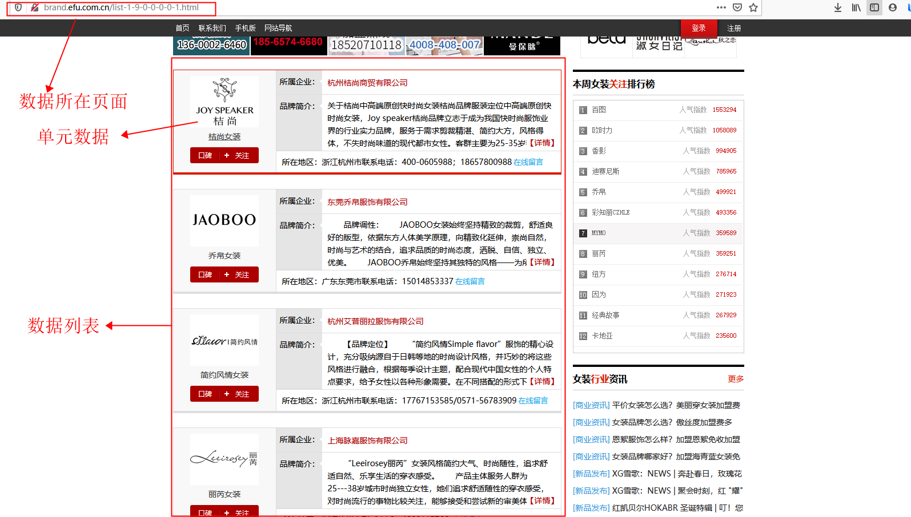
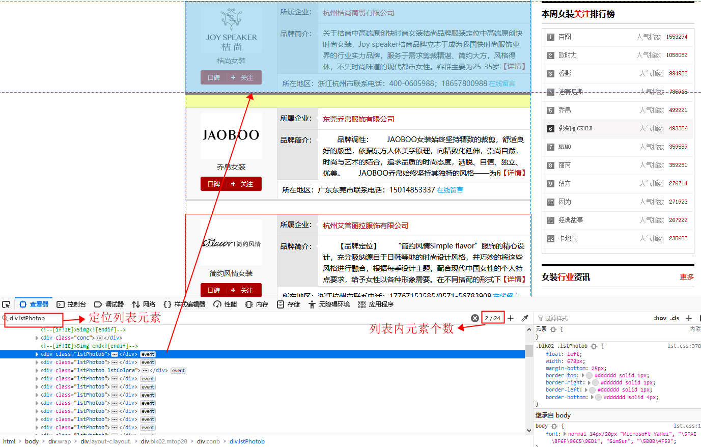
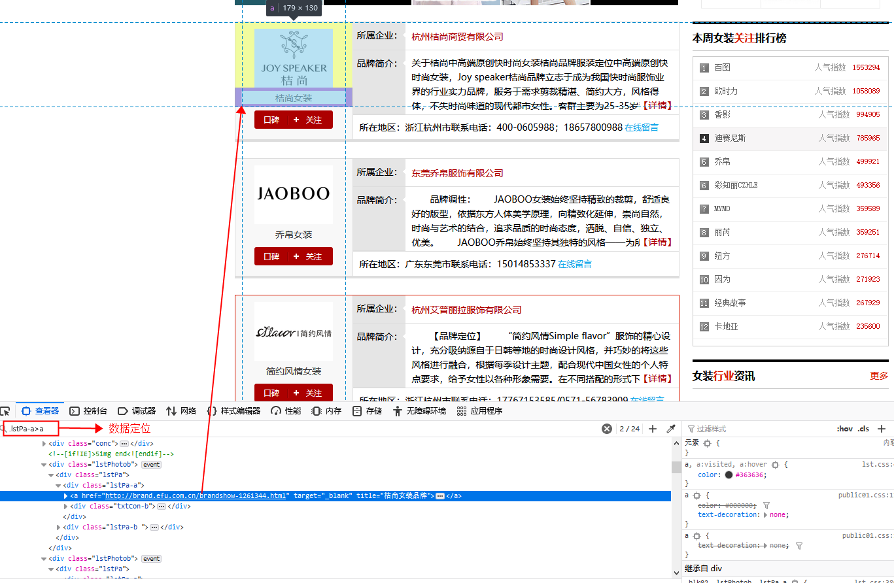
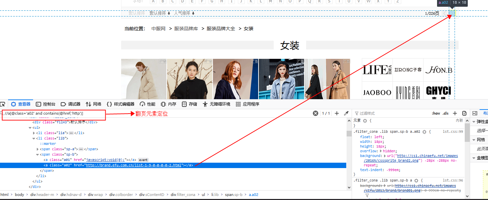

[一个简单的爬虫工具](https://github.com/nytao3980877/utils/tree/crawl)
### 前言
>一般情况下,网站中的数据是以列表、分页形式展示的，这样就有了规律可循：
>1. 打开数据页面网址
>2. 定位数据列表元素
>3. 循环获取每个单元中所需的数据
>4. 定位翻页元素
>5. 重复2-3-4获取全部数据
>
>那么将定位元素参数和逻辑代码进行分离，就可以达到不该变、只改变配置参数以适应符合上述规律的网站

### 实例
>这是一个服装品牌网站信息
>
>
>
>定位数据列表元素
>
>
>
>定位数据元素
>
>
>
>翻页元素定位
>
>
>
###### 配置文件
```xml
<?xml version="1.0" encoding="UTF-8"?>
<!-- url:"数据所在网址路径"  fileName="功能名，后续生成的Excel文件的前缀" -->
<crwal url="http://brand.efu.com.cn/list-1-9-0-0-0-0-1.html" fileName="品牌网-1">
	<!--lis:"数据列表定位，结果为lsit列表"   selector:"选择器类型By的方法名"  value:"选择器参数" -->
	<lis selector="cssSelector" value="div.lstPhotob" >
		<!-- li:"每个数据定位，须唯一"  name:"数据名称（索引）"   type="数据所位于的元素的属性名" -->
		<li selector="cssSelector" value=".lstPa-a>a" type="text" name="品牌名称"/>
		<li selector="cssSelector" value=".sp-b>a" type="text" name="所属企业"/>
		<!-- link:"新页面数据的链接定位" -->
		<link selector="cssSelector" value=".sp-b>a">
			<!-- li:"新页面数据 获取方式及定位"-->
			<li selector="xpath" value="//dt[contains(text(),'地址')]/following-sibling::dd" type="text" name="企业地址"/>
			<li selector="xpath" value="//dt[contains(text(),'电话')]/following-sibling::dd" type="text" name="联系电话"/>
		</link>
	</lis>
	<!-- next:"翻页元素定位" -->
	<next selector="xpath" value="//a[@class='a02' and contains(@href,'http')]"/>
</crwal>
```
>linke标签为导向所需的新页面数据（详情）的链接元素（<a>标签）定位
###### 代码
>四个主要类：
>	- [Mapper：配置文件映射类](#mapper) 
>	- [ConfigEntity：配置文件解析、与Mapper联合使用返回配置文件数据](#config)
>	- [Module：逻辑模块类](#module)
>	- [Main：main方法、启动类](#main)
>
>四个工具类：
>	- Apputils：接口，基于selenium、二次封装一些功能，方便调用
>	- Driver：浏览器驱动类，封装一些webdriver的启动参数，方便调用
>	- Excel：读写Excel文件类
>	- Utils：工具类，封装了一些简单的工具，方便直接调用

><span id="mapper"/>
>为了之后更方便运用配置文件中的数据，写了一个配置文件映射
- Mapper：映射类
```java
public class Mapper {

	//选择器
	private String selector;
	//选择器参数
	private String value;
	//自定义数据名称
	private String name;
	//元素的属性类型
	private String type;

	//元素定位构造方法
	public Mapper(String selector, String value) {
		super();
		this.selector = selector;
		this.value = value;
	}
	//数据定位及信息构造方法
	public Mapper(String selector, String value, String name, String type) {
		super();
		this.selector = selector;
		this.value = value;
		this.name = name;
		this.type = type;
	}

	//以下是get、set、toString方法
}
```
><span id="config"/>
- ConfigEntity：配置解析类
```java
public class ConfigEntity {

	//配置文件
	private String file ;
	//根元素
	private Element root;
	
	public ConfigEntity(String file) {
		this.file=file;
		root();
	}
	//数据页面路径
	public String getUrl() {
		return root.attributeValue("url");
	}
	//功能名，生成的文件名前缀
	public String getFileName() {
		return root.attributeValue("fileName");
	}
	//翻页元素
	public Mapper getNext() {
		Element next = root.element("next");
		return getSelectorMapper(next);
	}
	//数据列表定位元素
	public Mapper getLis() {
		Element lis = root.element("lis");
		return getSelectorMapper(lis);
	}
	//所需数据集合
	public List<Mapper> getLi(){
		Element lis = root.element("lis");
		return li(lis);
	}

	//新页面数据链接元素
	public Mapper getLink() {
		Element lis = root.element("lis");
		Element link = lis.element("link");
		if(link!=null) {
			return getSelectorMapper(link);
		}
		return null;
	}
	
	//新页面数据集合
	public List<Mapper> getLinkLi(){
		Element lis = root.element("lis");
		Element link = lis.element("link");
		if(link!=null) {
			return li(link);
		}
		return null;
	}
	
	//根元素
	private void root() {
		SAXReader read = new SAXReader();
		Document doc = null;
		try {
			doc = read.read(new File(file));
			root = doc.getRootElement();
		} catch (DocumentException e) {
			e.printStackTrace();
		}
	}
	
	//解析数据集合，配置Mapper类型数据
	private List<Mapper> li(Element lis) {
		List<Mapper> list = new ArrayList<>();
		List<?> li = lis.elements("li");
		if(li!=null) {
			for (Object el : li) {
				Element e = (Element)el;
				list.add(getValueMapper(e));
			}
		}
		return list;
	}
	//为定位元素映射Mapper类型
	private Mapper getSelectorMapper(Element el) {
		return new Mapper(el.attributeValue("selector"), el.attributeValue("value"));
	}
	//为数据元素映射Mapper类型
	private Mapper getValueMapper(Element el) {
		return new Mapper(el.attributeValue("selector"), el.attributeValue("value"), el.attributeValue("name"), el.attributeValue("type"));
	}
}
```

><span id="module"/>
- Module：逻辑模块
```java
public class Module implements AppUtils{
	//配置文件路径
	public static final String FILE = "src/main/resources/config/";
	//浏览器驱动
	private WebDriver driver;
	//配置文件解析
	private ConfigEntity cf;
	//生成后的文件名
	private String fileName;
	
	public Module(WebDriver driver,String configFile) {
		this.driver = driver;
		cf = new ConfigEntity(FILE+configFile);
		this.fileName = cf.getFileName();
	}
	 
	public Module(WebDriver driver,String configFile,String fileName) {
		this.driver = driver;
		cf = new ConfigEntity(configFile);
		this.fileName = cf.getFileName()+"-"+fileName;
	}
	
	/**
	 * 主接口
	 */
	public void crawl() {
		try {
			//打开数据所在页面
			openUrl();
			//获取全部数据
			List<Map<String, String>> list = all();
			int size = list.size();
			System.out.println("-----共"+size+"条------------");
			//生成Excel文件
			fileName = Excel.write(list, fileName);
			//更改文件内容格式（设预览图、超链接、自动换行）
			Excel.resetFormat(fileName);
			System.out.println("完成！");
		} catch (Exception e) {
			e.printStackTrace();
		}finally {
			//关闭驱动
			quit();
		}
	}
	
	/**
	 * 打开数据所在页面
	 */
	private void openUrl() {
		driver.get(cf.getUrl());
		sleep(1500);
	}
	/**
	 * 获取全部数据
	 * @return
	 */
	private List<Map<String, String>> all() {
		List<Map<String,String >> list =new ArrayList<>();
		while (true) {
			//数据列表集合
			List<WebElement> lis = els(cf.getLis());
			if(lis!=null) {
				for (WebElement el : lis) {
					//获取单条数据
					Map<String, String> map = one(el);
					if(map.isEmpty())continue;
					list.add(map);
				}
			}
			//翻页
			WebElement next = el(cf.getNext());
			if(next==null)break;
			new Actions(driver).moveToElement(next).click().perform();
			sleep(1500);
		}
		return list;
	}
	
	/**
	 * 获取一条数据
	 * @param el 每条数据所在元素
	 * @return
	 */
	private Map<String, String> one(WebElement el) {
		Map<String , String> map = new LinkedHashMap<String, String>();
		//获取所需数据的mappe对象集合
		List<Mapper> lis = cf.getLi();
		if(!lis.isEmpty()) {
			for (Mapper mapper : lis) {
				//设置数据
				put(map, mapper,el);
			}
		}
		//获取新页面数据
		
		//定位连接元素
		Mapper link = cf.getLink();
		if(link!=null) {
			//打开新页面
			WebElement linkel = el(el,link);
			new Actions(driver).moveToElement(linkel).click().perform();
			//获取当前页面句柄
			String hw = driver.getWindowHandle();
			//获取所有页面句柄
			Set<String> hws = driver.getWindowHandles();
			for (String h : hws) {
				if(!h.equals(hw)) {
					//进入新页面（driver初始时已关闭全部页面。正常情况下，此时只有两个页面）
					driver.switchTo().window(h);
					sleep(3000);
					//获取新页面数据mapper集合，设置数据内容
					List<Mapper> linkLis = cf.getLinkLi();
					if(linkLis!=null&&!linkLis.isEmpty()) {
						for (Mapper mapper : linkLis) {
							put(map, mapper,null);
						}
					}
					//关闭新页面
					driver.close();
					//转回数据列表所在页面
					driver.switchTo().window(hw);
				}
			}
		}
		System.out.println(map);
		return map;
	}
	

	/**
	 * 根据mapper对象获取by对象
	 * @param mapper
	 * @return
	 */
	private By by(Mapper mapper) {
		String selector = mapper.getSelector();
		String value = mapper.getValue();
		switch (selector) {
		case "tagName":
			return By.tagName(value);
		case "className":
			return By.className(value);	
		case "cssSelector":
			return By.cssSelector(value);	
		case "xpath":
			return By.xpath(value);	
		case "id":
			return By.id(value);
		case "linkText":
			return By.linkText(value);
		case "name":
			return By.name(value);
		case "partialLinkText":
			return By.partialLinkText(value);
		}
		return null;
	}
	
	//以下三个方法是根据mapper对象获取元素
	
	private WebElement el(Mapper mapper) {
		return findElement(by(mapper));
	}
	
	private WebElement el(WebElement el,Mapper mapper) {
		return findElement(el,by(mapper));
	}
	private List<WebElement> els(Mapper mapper) {
		return findElements(by(mapper));
	}
	/**
	 * 向map中添加数据
	 * @param map map对象
	 * @param mapper mapper对象
	 * @param e 定位到的数据元素
	 */
	private void put(Map<String, String> map,Mapper mapper,WebElement e) {
		WebElement el = e==null? el(mapper) : el(e,mapper);
		//获取数据名称，设置map的key
		String name = mapper.getName();
		String value = "";
		if(el!=null) {
			//根据数据所位于元素中的属性类型获取数据
			String type = mapper.getType();
			if(type.equals("text")) {
				value = el.getText().trim();
				int index = value.indexOf(":")>=0? value.indexOf(":") : value.indexOf("：");
				if(index==0) {
					value = value.substring(1);
				}else if(index>=1&&index==value.length()-1) {
					value = value.substring(0, index);
				}
			}else {
				value = el.getAttribute(type).trim();
				if(value.startsWith("//"))value = "http:"+value;
			}
		}
		//map对象添加键值队
		map.put(name, value);
	}
	public String getFileName() {
		return fileName;
	}
	public void setFileName(String fileName) {
		this.fileName = cf.getFileName()+"-"+fileName;
	}
	public ConfigEntity getCf() {
		return cf;
	}
	
	@Override
	public WebDriver getDriver() {
		return driver;
	}

}
```

><span id="main"/>
- Main：启动类
```java
public class Main {

	public static void main(String[] args) {
		String FILE = "config.xml";
		//创建模块Module对象（这里用的是远程debug模式连接已经打开的浏览器，有些需要登录的网站，可以先登录再连接）
		Module m = new Module(Driver.buildChromeDriver(9999),FILE,"女装");
		try {
			//执行爬虫方法
			m.crawl();
		} catch (Exception e) {
			e.printStackTrace();
		}finally {
			//关闭当前程序
			System.exit(0);
		}
	}
	
	public static void run360() {
		Runtime run = Runtime.getRuntime();
		try {
			//run.exec("taskkill /f /fi \"imagename eq 360se.exe\" /t");
			run.exec("D:\\360\\360se6\\Application\\360se.exe --remote-debugging-port=9999");
		} catch (IOException e) {
			e.printStackTrace();
		}
	}
}
```

